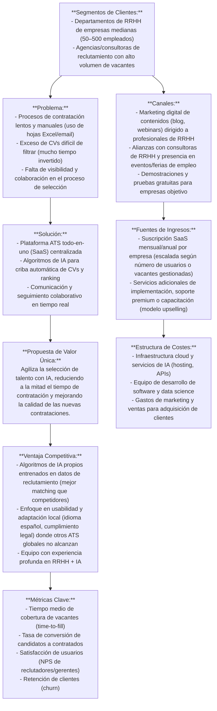
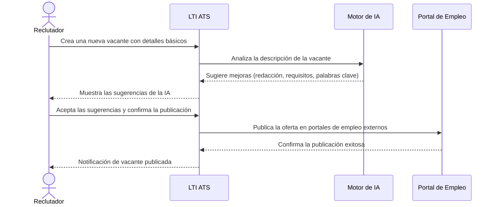
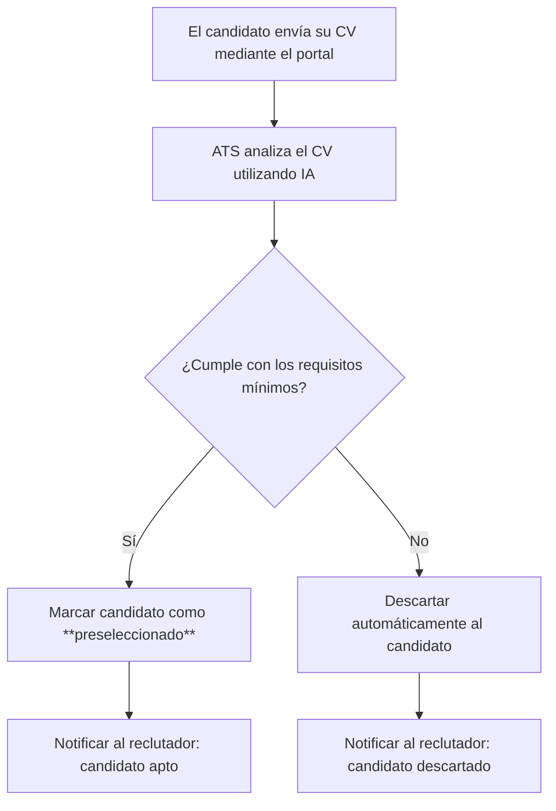
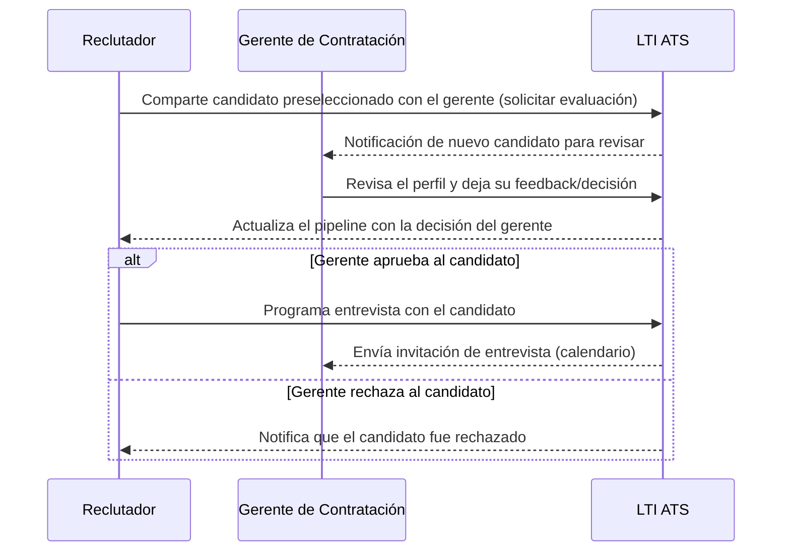
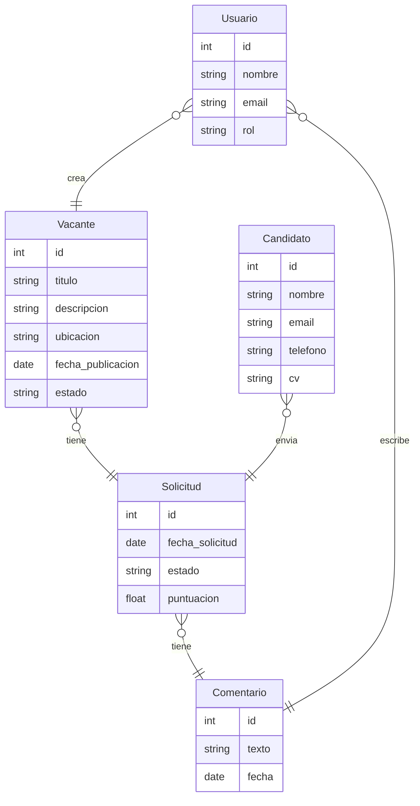
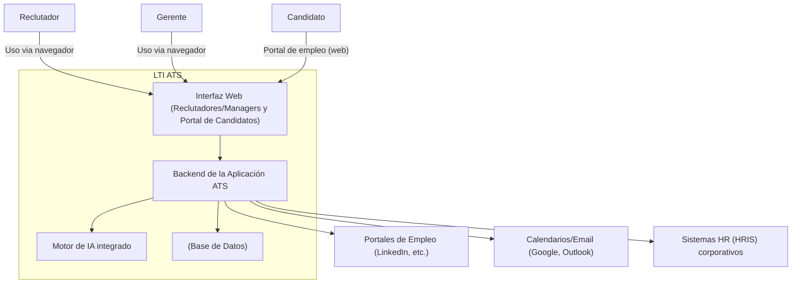
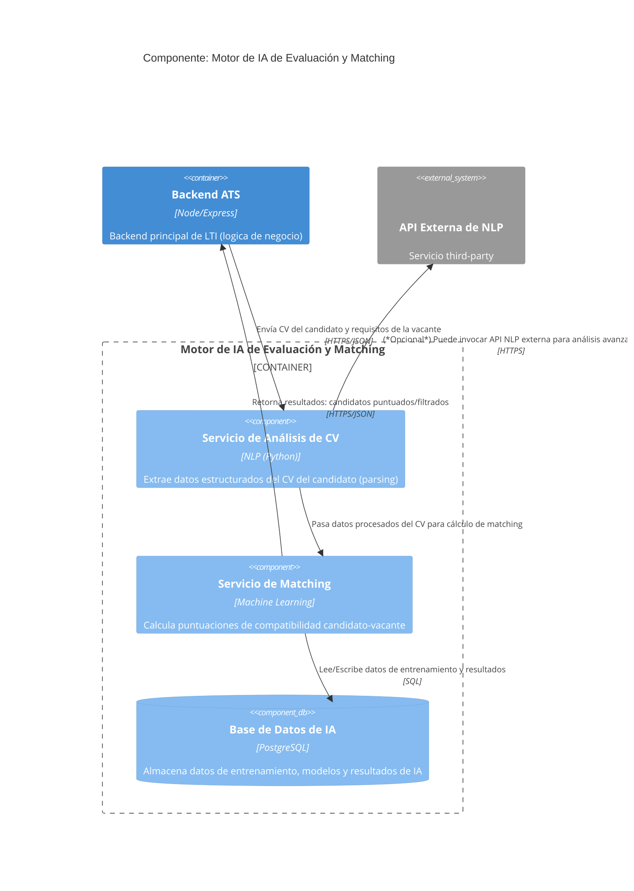

# LTI – Visión de Producto y Arquitectura (Versión 1)

## 1. Descripción breve del software LTI

LTI es un sistema de seguimiento de candidatos (ATS, por sus siglas en inglés) de nueva generación orientado a optimizar y agilizar los procesos de reclutamiento. Se trata de una plataforma SaaS (Software como Servicio) que centraliza la gestión de vacantes y candidatos, incorporando inteligencia artificial para automatizar tareas repetitivas (como el cribado de CVs) y priorizar a los mejores candidatos de forma objetiva. 

La visión del producto LTI es acelerar la contratación y mejorar la calidad de las incorporaciones mediante tecnología avanzada con una experiencia de usuario sencilla. Entre sus ventajas competitivas destacan un motor de IA propio para matching de candidatos más preciso, funcionalidades de colaboración en tiempo real entre reclutadores y gerentes, y la integración fluida con herramientas externas del sector (portales de empleo, calendarios, sistemas de RRHH). Esto le permite superar las limitaciones de muchos ATS tradicionales que suelen ser rígidos, manuales o carecer de automatizaciones inteligentes.
# 2. Funciones principales del sistema

La primera versión de LTI ATS incluye las siguientes funciones clave:

- **Publicación de vacantes multicanal**: permite crear la oferta una vez y publicarla en múltiples portales de empleo y en la web de la empresa con un solo clic.

- **Cribado y puntuación automática con IA**: el sistema analiza los currículums usando algoritmos de IA, filtrando candidatos automáticamente y asignando una puntuación de adecuación para priorizar a los mejores perfiles.

- **Base de datos de candidatos unificada**: todos los candidatos quedan registrados con su perfil completo (datos de contacto, CV parseado, historial de interacciones), evitando información duplicada y facilitando búsquedas futuras de talento.

- **Comunicación centralizada con candidatos**: envío de correos electrónicos automatizados y personalizables (confirmación de recepción de CV, convocatorias a entrevista, notificaciones de estado), e integración con calendarios para agendar entrevistas fácilmente.

- **Colaboración recruiter–manager**: herramientas para que reclutadores y gerentes de contratación trabajen en equipo, compartiendo notas y feedback sobre candidatos, aprobando avances en el pipeline y recibiendo notificaciones de actualizaciones.

- **Analíticas e informes de reclutamiento**: panel de control con métricas clave (tiempo medio de cobertura de vacantes, fuente de los candidatos contratados, ratio de aceptación de ofertas, etc.) que ayuda a identificar cuellos de botella y mejorar el proceso continuamente.

- **Integraciones con herramientas externas**: conectores para publicar ofertas automáticamente en portales de empleo populares (por ejemplo LinkedIn), sincronizar entrevistas con calendarios (Google/Microsoft) y exportar candidatos contratados al sistema HRIS de la empresa.

- **Automatizaciones de flujo de trabajo**: reglas personalizables para automatizar tareas repetitivas, por ejemplo: enviar un email de agradecimiento o rechazo a todos los candidatos descartados en una etapa, recordar a un gerente que evalúe a un candidato pendiente, o mover automáticamente candidatos en el pipeline según sus resultados.

## 3. Lean Canvas del modelo de negocio

A continuación se resume el modelo de negocio de LTI en un Lean Canvas, identificando los elementos estratégicos principales (Problema, Segmentos de Clientes, Propuesta de Valor, Solución, Canales, Ingresos, Costes, Ventaja Competitiva y Métricas Clave):

## 4. Casos de uso principales

A continuación se describen tres casos de uso fundamentales del sistema LTI, cada uno con un diagrama ilustrativo en Mermaid.

### Caso de uso 1: Publicación de vacantes con IA

En este caso, un reclutador utiliza LTI para publicar una nueva oferta de empleo con la ayuda de IA. El sistema analiza la descripción del puesto y sugiere mejoras (por ejemplo, incluir habilidades clave o clarificar requisitos), que el reclutador puede aceptar antes de publicar la vacante en múltiples portales.

### Caso de uso 2: Criba automática de candidatos

LTI agiliza la revisión inicial de candidatos utilizando IA para el filtrado. Cuando un candidato aplica a una vacante, el sistema analiza automáticamente su CV y determina si cumple los criterios requeridos. Como resultado, marca al candidato como **preseleccionado** (si encaja bien) o lo **descarta** (si no cumple el perfil), notificando al reclutador del resultado.

### Caso de uso 3: Colaboración recruiter–manager en el pipeline

LTI facilita la interacción entre el **reclutador** y el **gerente de contratación** durante el proceso de selección. En este escenario, el reclutador comparte un candidato preseleccionado con el gerente a través de la plataforma; el gerente revisa el perfil en LTI y registra su decisión o feedback. Si el gerente **aprueba** al candidato, el reclutador continúa el proceso (por ejemplo, programando una entrevista); si el gerente **rechaza** al candidato, el sistema marca al candidato como descartado y notifica al reclutador.

## 5. Modelo de datos del sistema

A nivel de datos, LTI maneja las siguientes **entidades principales**, con sus atributos más relevantes y relaciones entre sí:

- **Usuario**: representa a un usuario del sistema (p. ej. un reclutador o un gerente). Atributos: id (entero), nombre (texto), email (texto), rol (texto – indica si es reclutador, gerente, administrador, etc.).

- **Vacante**: representa una oferta de empleo publicada en el sistema. Atributos: id (entero), título (texto), descripción (texto), ubicación (texto), fecha_publicación (fecha), estado (texto – p. ej. abierta, cerrada).

- **Candidato**: representa a una persona que aplica a las vacantes. Atributos: id (entero), nombre (texto), email (texto), teléfono (texto), CV (texto o URL del currículum vitae).

- **Solicitud**: representa la postulación de un candidato a una vacante (es decir, una candidatura a un puesto). Atributos: id (entero), fecha_solicitud (fecha), estado (texto – p. ej. en proceso, rechazado, contratado), puntuación (número decimal – score calculado por la IA o evaluaciones).

- **Comentario**: representa comentarios o notas dejadas por usuarios sobre una candidatura específica. Atributos: id (entero), texto (texto), fecha (fecha/hora).

**Relaciones principales entre entidades**:

- Un **Usuario** (reclutador) puede crear múltiples **Vacantes** en el sistema (cada vacante tiene un usuario creador).

- Cada **Vacante** puede recibir muchas **Solicitudes** de candidatos (candidaturas); a su vez, cada Solicitud pertenece a una única Vacante.

- Un **Candidato** puede enviar varias **Solicitudes** a distintas vacantes; cada Solicitud involucra a un único Candidato y una Vacante dada.

- Los **Usuarios** (reclutadores o gerentes) pueden escribir **Comentarios** sobre las Solicitudes para registrar evaluaciones o notas; una Solicitud puede tener múltiples Comentarios de diferentes usuarios (o del mismo en distintos momentos).

- (Otras relaciones posibles: asignación de **responsables** a una Vacante, etc., pueden agregarse en futuras versiones.)

El siguiente diagrama ER resume estas entidades y sus relaciones:

## 6. Diseño del sistema a alto nivel

La arquitectura de LTI ATS sigue un diseño modular de múltiples capas, desplegado en la nube. Los **usuarios internos** (reclutadores y gerentes) acceden a una **interfaz web segura** para gestionar el proceso de selección, mientras que los **candidatos** interactúan con un **portal de empleo** público (parte del frontend) para inscribirse a las vacantes. En el lado servidor, un **backend** central se encarga de la lógica de negocio (gestión de usuarios, vacantes, candidatos, solicitudes, etc.) y expone APIs para las distintas funciones. Este backend se comunica con un **motor de IA** integrado para realizar tareas avanzadas como el análisis de currículums y cálculo de puntuaciones de matching. Toda la información persiste en una **base de datos** centralizada. 

Además, el sistema LTI se integra con varios **servicios externos** clave para ampliar sus funcionalidades: por ejemplo, con **portales de empleo externos** (para publicar automáticamente las vacantes en sitios como LinkedIn u otros), con **servicios de calendario y correo electrónico** (para enviar notificaciones y coordinar entrevistas en las agendas de los participantes) y con **sistemas corporativos de RRHH (HRIS)** de las empresas clientes (para sincronizar datos de contrataciones, altas de empleados, etc.). En la figura siguiente se muestra un diagrama de alto nivel de la arquitectura, incluyendo los principales componentes y sus interacciones:

*(En el diagrama, los usuarios **Reclutador** y **Gerente** representan a los empleados de la empresa que usan LTI; el **Candidato** es un usuario externo que accede al portal de empleo. Los componentes externos como portales, calendarios y HRIS están fuera del límite del sistema LTI pero se integran vía API con el backend.)*

## 7. Diagrama C4 de un componente clave

Como componente clave se destaca el **Motor de IA de Evaluación y Matching**, responsable de analizar los CVs de candidatos y compararlos con los requisitos de las vacantes para apoyar las decisiones de selección. A continuación se presenta un diagrama de nivel de componentes *(C4 Component Diagram)* que desglosa este motor de IA en sus subcomponentes internos y muestra cómo interactúa con otras partes del sistema:

En el diagrama C4 anterior, el **Motor de IA** (contenedor) se compone de dos subcomponentes principales: un servicio de *parsing* de CVs (Servicio de Análisis de CV) y un servicio de *matching* (Servicio de Matching). El primero extrae información estructurada del currículum (educación, habilidades, experiencia, etc.), y el segundo utiliza esa información junto con los datos de la vacante para calcular un **puntaje de adecuación** o ranking del candidato. Estos componentes internos pueden apoyarse en una base de datos específica de IA para almacenar modelos entrenados, datos estadísticos o feedback de las decisiones (por ejemplo, para *machine learning* continuo). El backend principal del ATS interactúa con el motor de IA a través de APIs HTTP/JSON: enviando los datos necesarios (CVs y requisitos) y recibiendo las puntuaciones y resultados de vuelta. Adicionalmente, el motor de IA puede opcionalmente conectarse a algún servicio externo de NLP (por ejemplo, una API de análisis semántico de texto) para mejorar su análisis de lenguaje natural, aunque el núcleo de la lógica de matching reside en los algoritmos propios de LTI. Así, este componente de IA se integra plenamente en la arquitectura de LTI, aportando inteligencia y automatización al proceso de selección de personal.